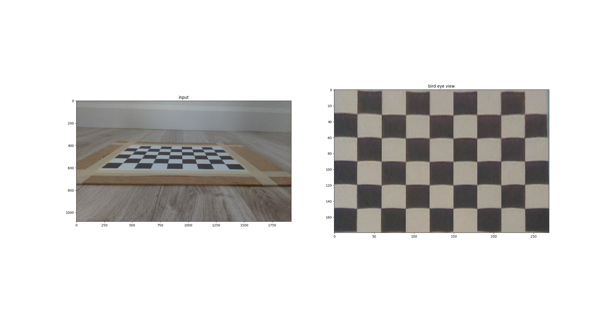
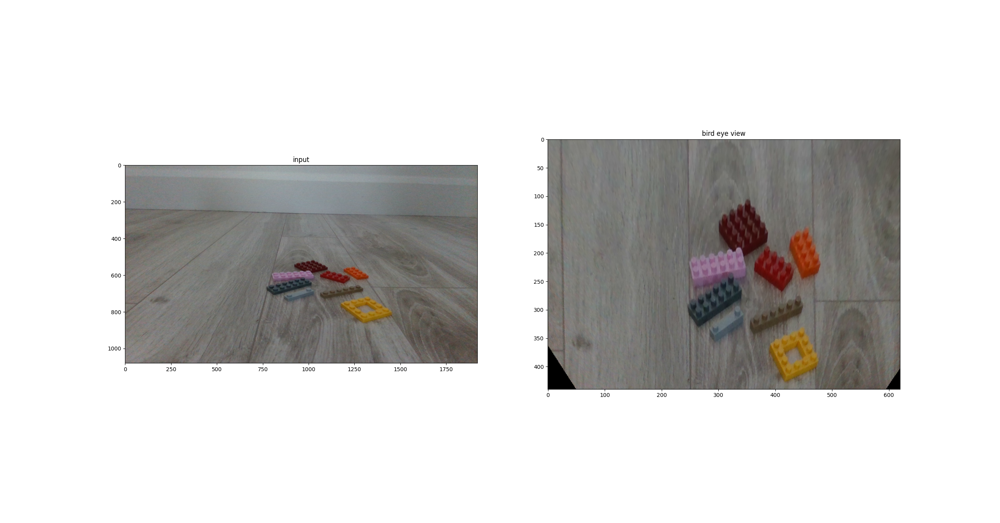
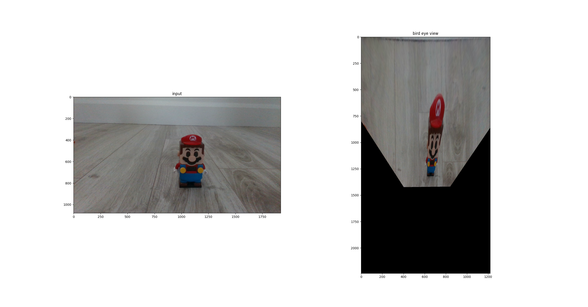
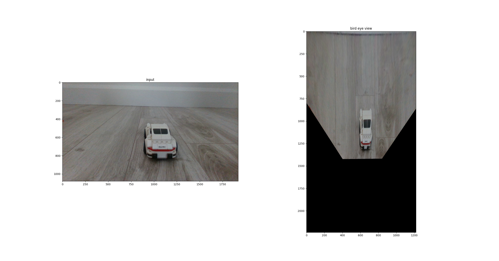

# birds eye view (360 camera)
Implementation of the birds eye view (or 360 camera) projection using python and an RGB camera. This can be used to generate top view around the camera similar to 360 camera view in cars. 

The basic idea is to project plane points (that represents ground) to image plane using camera parameters and then use these projected points to sample image that represents top view (bird eye view). 


# Steps
- calibrate camera
- estimate location of the camera with respect to ground
- project ground points to image plane using calibration parameters
- generate top view by sampling projected points

# Requirements
 - a camera
 - a calibration target 
 - opencv

# Examples
## target

## lego

## mario

## car



# TODO
Test 2 or more cameras

# How to use
```
python birds_eye_view.py
```


